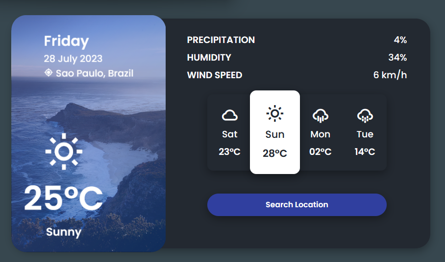

# Weather-AppInterface

## Resumo

Esse projetinho foi criado seguindo o tutorial da . Segui o tutorial com o intuito de relembrar algumas coisas que havia me esquecido. Além disso, também consegui aprender um pouco mais sobre as propriedades css transitions e transform.

